# IGH Pipeline Portal — Low Level Design

| Field | Value |
| --- | --- |
| Document | Low-Level Design — technical description |
| System | IGH Pipeline Portal |
| Companion document | `IGH-Pipeline-Portal-HLD.docx` (functional description) |
| Repositories | [`igh-dashboard`](https://github.com/akvo/igh-dashboard), [`igh-data-sync`](https://github.com/akvo/igh-data-sync), [`igh-data-transform`](https://github.com/akvo/igh-data-transform), [`igh-airflow`](https://github.com/akvo/igh-airflow), [`igh-dashboard-content`](https://github.com/akvo/igh-dashboard-content) |
| Production | https://pipeline.impactglobalhealth.org |
| Test | A separate test environment |
| Prepared by | Akvo Foundation |
| Date | September 2026 |
| Status | Draft for review |

---

## 1. System Purpose

The portal presents the Impact Global Health product R&D pipeline. It covers the candidates
in development and the approved health products for neglected diseases, emerging infectious
diseases and women's health. Users answer questions such as "what is being developed for this
disease?", "how has this pipeline grown since 2019?" and "which WHO priorities have nothing
working towards them?".

It is read-only. There is no data entry, no user account and no workflow. The HLD describes
what each page does. This document describes how the system is built.

The shape of the system follows from one fact: the data changes a few times a year, and the
site is read by the public. So nothing is computed on demand that can be computed in advance.
A batch pipeline pulls every record from Microsoft Dataverse, cleans it, reshapes it into a
star schema, and writes the result to a single SQLite file. That file is copied to the web
server. The web tier only reads it.

Four consequences follow:

- The web tier has no write path and no database server. It opens one file read-only.
- A data release is a file copy. It takes seconds and needs no downtime.
- The pipeline can fail without taking the site down. The site keeps serving the last good file.
- After cleaning and reshaping, the whole database is small enough to commit to git, so the
  staging site and the test suite share the same fixture.

Five repositories:

| Repository | Language | Role |
| --- | --- | --- |
| [`igh-data-sync`](https://github.com/akvo/igh-data-sync) | Python | Pulls every tracked entity out of Dataverse into a raw SQLite database. |
| [`igh-data-transform`](https://github.com/akvo/igh-data-transform) | Python | Cleans the raw data, then builds the star schema. |
| [`igh-airflow`](https://github.com/akvo/igh-airflow) | Python | Orchestrates the other two and ships the result to production. |
| [`igh-dashboard`](https://github.com/akvo/igh-dashboard) | TypeScript, JavaScript | The GraphQL API and the Next.js front end. |
| [`igh-dashboard-content`](https://github.com/akvo/igh-dashboard-content) | Text | The site's copy, in a form non-developers can edit. |

---

## 2. System context diagram

**Reading the diagrams.** Orange boxes are components built for this system. Cream cylinders
are data stores. Grey boxes are external systems. Beige boxes are people, and the Airflow
DAGs. A solid arrow carries data or a request, and its label says what flows. A dotted arrow
shows one thing starting or running another. A thick arrow is the one file copy between the
two machines. Steps inside a numbered sequence are not labelled; the numbers are the order.


IGH curators maintain the pipeline in Dataverse. The portal reads from it. Visitors read the
portal. Nothing writes back to Dataverse.

---

## 3. Container Diagram


Two virtual machines. Both run Docker Compose behind Traefik.

**Airflow VM.** Apache Airflow orchestrates the three DAGs described in section 5.1. The Airflow image has `igh-data-sync` and `igh-data-transform` installed as ordinary Python packages, and the DAG
tasks call them directly. Three SQLite files live on a volume: bronze, silver and gold.

**Dashboard VM.** Traefik terminates TLS and routes `/` to Next.js on port 3000 and `/api/*`
to Apollo Server on port 4000, stripping the `/api` prefix. The backend opens
`star_schema.db` read-only from a host-mounted directory.

The only thing that passes between the two machines is the finished gold database. The
deployment DAG sends it as a single file over an authenticated SSH connection. There is no
downtime: the site is never stopped, and requests already in flight finish against the previous
file. Section 5.1 describes the steps.

| Container | Image or stack | Port | Source |
| --- | --- | --- | --- |
| traefik (Airflow) | `traefik:v3.6.7` | 80, 443 | `igh-airflow/self-hosted/docker-compose.yml` |
| Apache Airflow | `apache/airflow:3.1.6-python3.11` plus the two pipeline packages | 8080 (UI) | `igh-airflow/docker/Dockerfile`, `igh-airflow/self-hosted/docker-compose.yml` |
| traefik (dashboard) | `traefik:v3.3` | 80, 443 | `igh-dashboard/self-hosted/docker-compose.yml` |
| frontend | `node:20-alpine`, Next.js standalone | 3000 | `igh-dashboard/frontend/Dockerfile` |
| backend | `node:20-alpine` | 4000 | `igh-dashboard/backend/Dockerfile` |

The Airflow image is built once from `igh-airflow/docker/Dockerfile` with both pipeline
packages installed into it.

The dashboard stack puts all four services in one network namespace. A `mainnetwork` container
holds the published ports and the others join it with `network_mode: service:mainnetwork`.
That is why Traefik routes to `http://localhost:3000` and `http://localhost:4000`.

---

## 4. Component Diagram

### 4.1 Data pipeline


Three repositories make one pipeline. Airflow orchestrates; the two Python packages do the
work.

**Orchestration.** `igh-airflow` holds three DAGs, run in order: ingestion, transform,
deployment. Each DAG calls a Python function from one of the packages below. The Airflow UI
also offers a download of a consistent snapshot of the bronze, silver or gold database, for
inspecting a run without touching the server. Section 5.1 covers the DAGs in detail.

**Sync.** `igh-data-sync` reads every tracked Dataverse entity and writes it, unchanged, into
the bronze database. It authenticates with OAuth2 client credentials, fetches each entity page
by page, and resolves option-set labels from the same response that carries the codes. Every
run builds the bronze database from scratch. The package can version rows over time — the
tables carry `valid_from` and `valid_to` — but this is not used: each record is written once
per run. Section 6.7 explains why the capability exists.

**Transform.** `igh-data-transform` has two halves that share only the command-line entry
point. Bronze to silver is a cleaning pass over every table: five reusable functions in
`cleanup.py`, and a dedicated transformer for each of the five tables that need one. Silver to
gold builds the star schema, in seven steps:

1. **Read the map.** `config/schema_map.py` declares every gold table — its source table,
   primary key and one expression per column.
2. **Extract.** `core/extractor.py` opens the silver database read-only and loads the option
   set lookups into memory — the same code-to-label tables the sync built from Dataverse
   choice fields (section 5.5), carried through into silver. They are the only thing loaded up
   front, because the `OPTIONSET:` expressions in step 3 need a code-to-label map for every
   row; every other table is read as the table that needs it is built.
3. **Evaluate.** `core/transformer.py` and `core/expressions.py` compute each column from its
   expression — `COALESCE`, `CASE WHEN`, `LOOKUP:`, `OPTIONSET:` — and resolve foreign keys
   against the tables already loaded.
4. **Generate DDL.** `core/ddl_generator.py` writes the `CREATE TABLE` statements from the
   map, inferring types from column-name conventions.
5. **Load in order.** `core/loader.py` writes dimensions first, then facts, then bridges,
   recording each generated key so the next table can reference it.
6. **Verify.** The loader runs an orphan check on every foreign key and prints what it finds.
7. **Index.** The loader creates one index for each dashboard query pattern.

Section 6.1 explains why the map is declarative and why gold is rebuilt from nothing every run.

### 4.2 Dashboard backend


Apollo Server with a schema-first SDL in `typeDefs.ts` and a hand-written resolver map.
Resolvers hold no logic. Each one calls a function in `db/queries/`, one module per query
domain, and every module runs hand-written SQL against the gold file through one shared
read-only connection.

`columnRegistry.ts` is worth highlighting. It maps a front-end column name to a SQL
expression and describes how that column may be filtered and sorted. `columnFilters.ts` and
`distinctValues.ts` build `WHERE` and `ORDER BY` clauses from it. Section 6.3 explains how this
lets one table component drive four datasets.

The gold file is the join to the pipeline: the deployment DAG writes it, and the backend's
`DatabaseManager` reopens it when the file changes.

### 4.3 Dashboard frontend


Next.js with the App Router. Every page and layout is a client component; Next.js supplies
routing, bundling and the standalone server, not server rendering.

Pages compose sections from `src/components/`. Sections read data through one hook per query
in `src/graphql/hooks/`, which sit on Apollo Client and an in-memory result store. Filter state
is held in the URL. Copy comes from `src/content/` through a `t()` accessor. Section 6.4 covers
each of these.

### 4.4 All repositories together


Left to right: Dataverse is the source, the three pipeline repositories turn it into one gold
file, the dashboard serves that file, and an analyst reads the result in a browser. The
Next.js pages are the only thing a user ever sees. Everything to their left exists to keep
them correct.

---

## 5. Data flow

### 5.1 The Airflow DAG chain


Three DAGs, run in order. Each writes a new database file, and the next DAG starts when that
file is written. The chain is wired with Airflow 3 **Assets**: a task that finishes with an
asset in its `outlets` emits an event, and a DAG with that asset in its `schedule` starts.
`igh-airflow/dags/igh_assets.py` declares one asset per database. Declaring the chain this way rather
than in task code means the dependency is visible in the Airflow UI: each DAG shows the asset
it waits on and the asset it produces.

| DAG | Display name | Starts | Retries | Repository that does the work |
| --- | --- | --- | --- | --- |
| `igh_ingestion` | 1. IGH Ingestion | By hand, in the Airflow UI | 2 | `igh-data-sync` |
| `igh_transform` | 2. IGH Transform | When bronze is written | 1 | `igh-data-transform` |
| `igh_deployment` | 3. IGH Deployment | When gold is written, if `DEPLOY_AUTO_TRIGGER` is set; otherwise by hand | 1 | none — `scp` and `ssh` |

Retries wait five minutes. Task timeouts are two hours for the sync and one hour for each
transform step.

**`igh_ingestion`** has one task, `sync_dataverse`. It deletes the bronze database and syncs
every entity from scratch. The DAG exposes a checkbox, `update_mode`, which keeps the existing
bronze database and fetches only records changed since the last run. This is not part of the
current operating procedure. It is groundwork for a future update process built on row
versioning, described in section 6.7.

**`igh_transform`** has two tasks in sequence, `bronze_to_silver` then `silver_to_gold`. This
DAG must be unpaused or the asset event goes nowhere.

**`igh_deployment`** has two tasks. `scp_gold_db` copies the gold file to the dashboard server
as `star_schema.db.new`. `swap_remote_db` renames it over the live file with one remote `mv`.
The rename is atomic, and it changes the file's inode. The backend's `DatabaseManager` checks
the inode on every connection and reopens the file when it changes. No restart, no dropped
request, no half-written database served to a visitor. Both tasks skip themselves when
`DEPLOY_TARGET_HOST` is `local` or empty, so the DAG is safe on a developer machine.

**How the pipeline code reaches Airflow.** `igh-data-sync` and `igh-data-transform` are
declared as git dependencies in `igh-airflow/pyproject.toml` and pinned to an exact commit in
`uv.lock`. They are installed into the Airflow image at build time and called as Python
functions — `run_sync()`, `bronze_to_silver()`, `silver_to_gold()`. Every task is a
`PythonOperator`.

The consequence matters more than the mechanism. When either package changes — a bug fix, or
the configuration for a new reporting year in the transform — Airflow keeps running the old
code until two things happen: the pinned commit in `uv.lock` is moved forward, and
`igh-airflow` is redeployed. The deploy rebuilds the image, which installs the new version.
Section 5.3 places these steps in the full update procedure.

**Inspecting a run.** The Airflow UI carries three extra menu items under *Downloads* —
Bronze DB, Silver DB, Gold DB — served by `GET /igh/download/{layer}` from
`plugins/igh_download_plugin.py`. Each copies the file through SQLite's online backup API, so
the snapshot is transactionally consistent even while a transform is writing to it, and
streams the copy to the browser. The route requires an authenticated Airflow session. It is
the quickest way to pull the output of any stage onto a developer machine and look at what a
run actually produced.

### 5.2 How staging differs

Staging does not use Airflow at all.

On staging, a developer runs the sync and the transform on their own machine, inside the
`igh-data-transform` checkout:

```bash
./sync-and-run-etl.sh              # sync Dataverse, then bronze to silver to gold
./sync-and-run-etl.sh --skip-sync  # transform only
```

The run leaves the finished gold file at `data/star_schema.db` in that checkout. The developer
copies it into the `igh-dashboard` checkout:

```bash
cp data/star_schema.db <igh-dashboard>/backend/star_schema.db
cp data/star_schema.db <igh-dashboard>/backend/tests/star_schema.db
```

- `backend/star_schema.db` — what the staging site serves.
- `backend/tests/star_schema.db` — what the test suite reads.

Both are committed, and `backend/star_schema.db` is the database staging serves. That one
decision explains the staging workflow:

- The staging database is whatever is on `main`. On every staging deploy, `update.sh` copies
  `backend/star_schema.db` into the directory the backend container mounts.
- The test suite has no seeding step and no mocks for the data layer. The e2e tests run real
  GraphQL operations against a real database.
- **New data breaks the tests.** The CSV golden files in `backend/tests/fixtures/csv/`, and
  the recorded counts in `backend/tests/fixtures/snapshots/`, describe the old data. The work
  is mechanical: run the suite, read the failures to confirm every change is one the new data
  explains, then re-run with `UPDATE_FIXTURES=1` to re-record both. Nothing is edited by hand.
  What the fixtures record is only the numbers; the invariants that must hold whatever the
  data says — three global health areas, buckets summing to their total, shares matching their
  counts, orderings — stay as ordinary assertions and are not re-recorded.

Production works the other way round. `IS_PRODUCTION=true` in `self-hosted/.env` makes the
deploy script skip the copy, so a code deploy never overwrites the file the Airflow pipeline
delivered.

### 5.3 The process of updating the data


1. **Run the sync locally.** `./sync-and-run-etl.sh` in `igh-data-transform`. It leaves a new
   `star_schema.db` in `data/`. Copy it into the `igh-dashboard` checkout as
   `backend/star_schema.db` and `backend/tests/star_schema.db`.

2. **Fix the tests.** Run `npm run check:all` from the `igh-dashboard` root and read the
   failures. Confirm each one is a change the new data explains. Then re-run with
   `UPDATE_FIXTURES=1` to re-record the CSV golden files and the snapshot counts. Never edit
   a fixture by hand — reading the failures first is what makes re-recording safe.

3. **Merge to main.** Open a PR; `qa.yml` runs on it. Staging deploys automatically on the push to `main` that the merge makes,
   with the committed database.

4. **QA on staging.** Check the counters, the trend years and the tables against what the data
   should say.

5. **Approval.**

6. **Move the Airflow pins.** In `igh-airflow`, `uv lock --upgrade-package igh-data-sync` and
   `uv lock --upgrade-package igh-data-transform` move the pinned commits to the versions just
   merged. `uv sync` on its own does not pull newer commits.

7. **Deploy Airflow.** Merge the lock-file change and publish a release. The deploy rebuilds the
   image with the new packages.

8. **Run the pipeline.** Trigger `igh_ingestion` in the Airflow UI. `igh_transform` follows on
   the asset event, and `igh_deployment` follows it if `DEPLOY_AUTO_TRIGGER` is set, or is
   triggered by hand. Production picks up the new file as soon as it lands.

### 5.4 Tables synced from Dataverse

`igh-data-sync/src/igh_data_sync/data/entities_config.json` lists **26** entities. Twenty-two
are synced in full.

| Entity | Table in bronze | What it holds |
| --- | --- | --- |
| `vin_candidate` | `vin_candidates` | Candidates and approved products |
| `vin_product` | `vin_products` | Product types and sub-products |
| `vin_disease` | `vin_diseases` | Diseases and disease groups |
| `vin_clinicaltrial` | `vin_clinicaltrials` | Clinical trials |
| `vin_source` | `vin_sources` | Publications and source records |
| `vin_rdstage` | `vin_rdstages` | R&D stages |
| `vin_rdstageproduct` | `vin_rdstageproducts` | Stage scales per product area |
| `vin_rdpriority` | `vin_rdpriorities` | WHO PPC, TPP and TRP priorities |
| `vin_archetype` | `vin_archetypes` | Archetypes |
| `vin_clinicalusestatus` | `vin_clinicalusestatuses` | Clinical use statuses |
| `vin_country` | `vin_countries` | Countries |
| `vin_region` | `vin_regions` | Regions |
| `vin_capparameter` | `vin_capparameters` | CAP parameters |
| `vin_developer` | `vin_developers` | Developers |
| `vin_vin_candidate_account` | `vin_vin_candidate_accountset` | Junction: candidate to organisation |
| `vin_vin_candidate_vin_rdpriority` | `vin_vin_candidate_vin_rdpriorityset` | Junction: candidate to WHO priority |
| `vin_vin_candidate_systemuser` | `vin_vin_candidate_systemuserset` | Junction: candidate to user |
| `vin_vin_candidate_vin_country` | `vin_vin_candidate_vin_countryset` | Junction: candidate to country |
| `vin_vin_candidate_vin_region` | `vin_vin_candidate_vin_regionset` | Junction: candidate to region |
| `vin_vin_clinicaltrial_account` | `vin_vin_clinicaltrial_accountset` | Junction: trial to sponsor |
| `vin_vin_clinicaltrial_account_collaborator` | `vin_vin_clinicaltrial_account_collaboratorset` | Junction: trial to collaborator |
| `vin_vin_clinicaltrial_vin_country` | `vin_vin_clinicaltrial_vin_countryset` | Junction: trial to country |

The remaining four are large tables shared across the whole Dataverse instance — accounts,
contacts, users and currencies. They are not pulled in full. The sync builds a graph of foreign
keys from the OData `$metadata` document, collects the IDs that the tables above point at, and
fetches only those rows. That keeps the bronze database to what the portal needs.

The sync also creates tables of its own. A current bronze database holds 26 entity tables,
**221** `_optionset_*` lookup tables, **13** `_junction_*` tables for multi-select fields, and
`_sync_state` and `_sync_log`.

Dataverse's system tables are deliberately not synced: business units, teams, roles,
privileges, import and plugin metadata, workflows, async operations, portal `adx_*` tables and
the rest. `igh-data-sync/README.md` lists them.

### 5.5 Option sets

Dataverse choice fields store an integer code. The label lives in entity metadata.

The obvious way to resolve them is to read the `EntityDefinitions` /
`PicklistAttributeMetadata` API. That was tested and rejected. Around 82 local option sets per
entity across 29 entities is roughly 2,400 extra API calls before a single row is fetched.
`igh-data-sync/specs/add-option-set-tables/plan.md` records the decision.

What it does instead: every request carries

```
Prefer: odata.maxpagesize=5000,
        odata.include-annotations="OData.Community.Display.V1.FormattedValue"
```

so Dataverse returns the label beside the code. `OptionSetDetector` scans each record for keys
ending `@OData.Community.Display.V1.FormattedValue`, and infers single-select from
multi-select: a `;` in the formatted value or a `,` in the raw value means multi-select. No
extra requests at all. Detection happens in the same call that writes the row.

`OptionSetStorage` then writes:

- `_optionset_{field}` — `code INTEGER PRIMARY KEY, label TEXT, first_seen TEXT`. Labels are
  updated in place if they change.
- `_junction_{entity}_{field}` — one row per selected option for a multi-select field. The
  multi-select column is stripped from the entity table.

`data/optionsets.json` is the one piece that does need a first pass. It is a **typing hint**,
not a prerequisite for detection. When it lists a field, `schema_initializer` creates that
column as `INTEGER`. When it does not, the column is created `TEXT` and a warning is printed.
The documented bootstrap is: sync once, run `generate-optionset-config`, delete the database,
sync again.

**The option this leaves open.** Because the label already arrives with every record, the
codes could be dropped and the resolved text stored directly in the entity column. That would
remove the two-pass bootstrap, remove `optionsets.json`, remove 221 lookup tables from bronze,
and make a first sync against a fresh Dataverse instance work with no setup. The costs are
real but small at this scale: a label change would have to be handled by the transform rather
than by one row in a lookup table, filtering would compare strings rather than integers, and
bronze rows would be larger. Multi-select fields would still need junction tables. This is
worth doing the next time the sync is revisited.

### 5.6 Cleaning: bronze to silver


`bronze_to_silver()` walks every table in the bronze database.

- **Empty tables are skipped.**
- **Five tables have dedicated transformers**, listed in `TABLE_REGISTRY`: `vin_candidates`,
  `vin_clinicaltrials`, `vin_diseases`, `vin_rdpriorities`, `vin_developers`. They receive the
  option set and lookup tables they need alongside the data.
- **Everything else takes the generic path**, `transform_table()`.

Both paths use the same five functions in `transformations/cleanup.py`:

| Function | What it does |
| --- | --- |
| `drop_columns_by_name` | Removes named columns if they are present. |
| `drop_empty_columns` | Removes columns that are NULL in every row. `valid_from` and `valid_to` are preserved. |
| `rename_columns` | Renames bronze column names to readable silver ones. |
| `normalize_whitespace` | Trims, collapses runs of whitespace, strips `<br>` tags and non-breaking spaces. |
| `replace_values` | Consolidates duplicate and deprecated values onto one canonical value. |

On top of that, the dedicated transformers do the work that is specific to one table:

- **`candidates.py`** — expands one Dataverse row into one row per reporting year, resolves
  R&D stage GUIDs to names, normalises the pipeline-inclusion columns onto one set of codes,
  and captures the strict current-year value the WHO page needs. This is the most involved
  transformer and section 6.6 covers it.
- **`clinical_trials.py`** — synthesises a source URL per registry, standardises trial phase,
  status, age group and sex.
- **`diseases.py`** — derives `disease_filter` and `disease_label`, and falls back for a
  missing global health area.
- **`developers.py`** — enriches developers from `accounts` and `vin_countries`.
- **`priorities.py`** — column drops and renames only. It is the simplest example to copy when
  adding a new one.

Option set tables are either copied through unchanged or replaced by the cleaned version a
transformer returned, then renamed per `OPTIONSET_RENAMES` so the lookup name matches the
silver column name — `_optionset_vin_approvalstatus` becomes `_optionset_approvalstatus`.

One convention is worth knowing. A comment marked

```python
# Special Case:
```

flags a workaround for a known defect in the upstream CRM data, not a rule of the domain. A
previous example: candidates entered in 2019 were not independently reviewed in 2021, so a
2021 "No" was overridden where 2019 said "Yes". Each of these is meant to be temporary and is
removed when the source data is corrected.

### 5.7 The gold database

The gold layer is a star schema in one SQLite file, `star_schema.db`: 14 dimensions, 3 facts
and 8 bridge tables.

**Facts and dimensions.** A *fact* table holds the things being counted — one row per
candidate per reporting year, one row per clinical trial, one row per publication. A
*dimension* table holds the things they are counted by — the disease, the product type, the
R&D stage, the date, the candidate's own descriptive attributes. A fact row carries an integer
key into each dimension it belongs to. A chart is a `GROUP BY` over a fact table, joined to
whichever dimensions supply the labels and the filters.

**Surrogate keys.** Every dimension row gets an integer primary key assigned by the loader as
it inserts — `disease_key`, `product_key`, `candidate_key` and so on. These have no meaning
outside the file and no relation to any Dataverse identifier; the Dataverse GUID is kept as an
ordinary column beside them. Two things follow. Joins compare small integers rather than
36-character strings. And the loader can rebuild the whole file from nothing on every run
without preserving any key from the previous run, because nothing outside the file refers to
those keys.

#### 5.7.1 The star


`fact_pipeline_snapshot` is the centre of the portal: one row per candidate per reporting
year, keyed to candidate, product, disease, technology type, regulatory status, stage and
date.


`fact_clinical_trial_event` is one row per trial, keyed to its candidate and to four dates;
disease and product are reached through the candidate. `fact_publication` is one row per
source document, keyed to its candidate.

#### 5.7.2 The bridge tables


A bridge table resolves a many-to-many relationship. A candidate has several developers,
several funders, several target countries, several age groups, several approving authorities,
several organisations and several WHO priorities. A star schema cannot put a list in a fact
row, and a delimited string would have to be parsed at query time. So each of these
relationships gets its own two-column table — a candidate key and the key of the other thing —
with one row per pair. There are eight: seven hanging off the candidate, and one linking a
clinical trial to its countries.

The dashboard's bridge queries are joins with no parsing. "Which candidates address this WHO
priority?" is `bridge_candidate_priority` joined to `dim_candidate_core`. "Where are trials for
this disease run?" is `bridge_trial_geography` joined to `dim_geography`.

**Why this shape.**

- Every page filters on the same four things — global health area, disease, product type and
  R&D stage. Conformed dimensions mean those four filters are the same joins on every query,
  so one set of indexes serves the whole site.
- Every trend chart is a `GROUP BY` over `fact_pipeline_snapshot`. Nothing is recomputed across
  years at query time.
- The whole thing is one file. That is what makes a data release a single copy.

Two examples of what the shape makes cheap:

| Question | Query shape |
| --- | --- |
| Candidates per R&D stage per review year, the chart on Pipeline trends | One grouped scan of `fact_pipeline_snapshot`, joined to `dim_phase` for the stage name and `dim_date` for the year. No subqueries, no string handling. |
| Candidates addressing a WHO priority, broken down by product type, the chart on WHO Priority alignment | `bridge_candidate_priority` joined to `fact_pipeline_snapshot` and `dim_product`, filtered on `priority_key`. One bridge join in place of parsing a delimited list of priorities for every candidate. |

**How it is built.** `silver_to_gold/config/schema_map.py` names every table: its
`_source_table`, its primary key and one expression per column. `core/ddl_generator.py`
generates the DDL, inferring `INTEGER` for names ending `_key`, `_id`, `_flag` or `_count`
and `TEXT` otherwise. `core/loader.py` loads in `TABLE_LOAD_ORDER` — dimensions, then facts,
then bridges — capturing each generated surrogate key so the next table can reference it.

`Loader.connect()` deletes the target file before it starts. The gold layer is a **full
rebuild every run**, never an update. A run either produces a complete database or is thrown
away.

**Foreign keys are not enforced.** The generated DDL has no `FOREIGN KEY` constraints. Instead
`Loader.verify_foreign_keys()` runs 22 orphan checks after loading and prints what it finds.
It reports; it does not fail the run. Section 6.2 gives the situations in which a check fails.

**Indexes.** 22, created by `Loader.create_indexes()` and chosen for specific dashboard
queries:

| Table | Index |
| --- | --- |
| `fact_pipeline_snapshot` | `(candidate_key, include_in_pipeline, date_key)`, `(is_active_flag, include_in_pipeline)`, `(candidate_key, is_active_flag, include_in_pipeline)` |
| `fact_clinical_trial_event` | `(candidate_key)`, `(status)`, `(trial_phase)` |
| `dim_candidate_core` | `(current_rd_stage)`, `(indication_type)`, `(candidate_type)`, `(test_format)` |
| `dim_disease` | `(disease_filter, secondary_disease_name)`, `(global_health_area)`, `(disease_group_name)` |
| `dim_candidate_regulatory` | `(approval_status)` |
| `dim_date` | `(full_date)` |
| bridges | `(candidate_key)` on each, plus `(location_scope, candidate_key)` on `bridge_candidate_geography` |

**Mapping back to Dataverse.** The source of each gold table is named by the `_source_table`
key of its entry in `schema_map.py`. The database itself records nothing about provenance
beyond a `last_sync_date` in `_etl_metadata`.

| Gold table | Source |
| --- | --- |
| `dim_product` | `vin_products` |
| `dim_disease` | `vin_diseases` |
| `dim_phase` | `vin_rdstages` |
| `dim_geography` | `vin_countries` |
| `dim_organization` | `accounts` |
| `dim_priority` | `vin_rdpriorities` |
| `dim_candidate_core` | `vin_candidates` |
| `dim_candidate_tech` | `vin_candidates`, distinct `technology_type` |
| `dim_candidate_regulatory` | `vin_candidates`, distinct approval-status combination |
| `dim_developer` | `vin_candidates.developersaggregated`, split on `;`, org type from `vin_developers` |
| `dim_funder` | `vin_candidates.knownfundersaggregated`, split on `;` |
| `dim_date` | generated, 2015 to 2030, one row per day |
| `dim_age_group` | the `agespecific` option set |
| `dim_approving_authority` | the `approvingauthority` option set |
| `fact_pipeline_snapshot` | `vin_candidates`, expanded per reporting year |
| `fact_clinical_trial_event` | `vin_clinicaltrials` |
| `fact_publication` | `vin_sources` |
| `bridge_candidate_geography` | `_junction_vin_candidates_new_targetcountry` UNION `vin_developers` location |
| `bridge_candidate_developer` | `vin_candidates.developersaggregated` |
| `bridge_candidate_funder` | `vin_candidates.knownfundersaggregated` |
| `bridge_candidate_priority` | `vin_vin_candidate_vin_rdpriorityset` |
| `bridge_candidate_age_group` | `_junction_vin_candidates_new_agespecific` |
| `bridge_candidate_approving_authority` | `_junction_vin_candidates_vin_approvingauthority` |
| `bridge_candidate_organization` | `vin_vin_candidate_accountset` |
| `bridge_trial_geography` | `vin_vin_clinicaltrial_vin_countryset` UNION parsed `vin_clinicaltrials.locations` |

Two notes. `dim_geography.region_name` is always `Unknown` — there is no region source in the
data yet. `bridge_candidate_priority` is filtered after the fact to candidates that are in the
pipeline.

An `OPTIONSET:column` expression resolves a Dataverse code back to its label using the
`_optionset_*` tables that `igh-data-sync` produced.

### 5.8 The GraphQL API

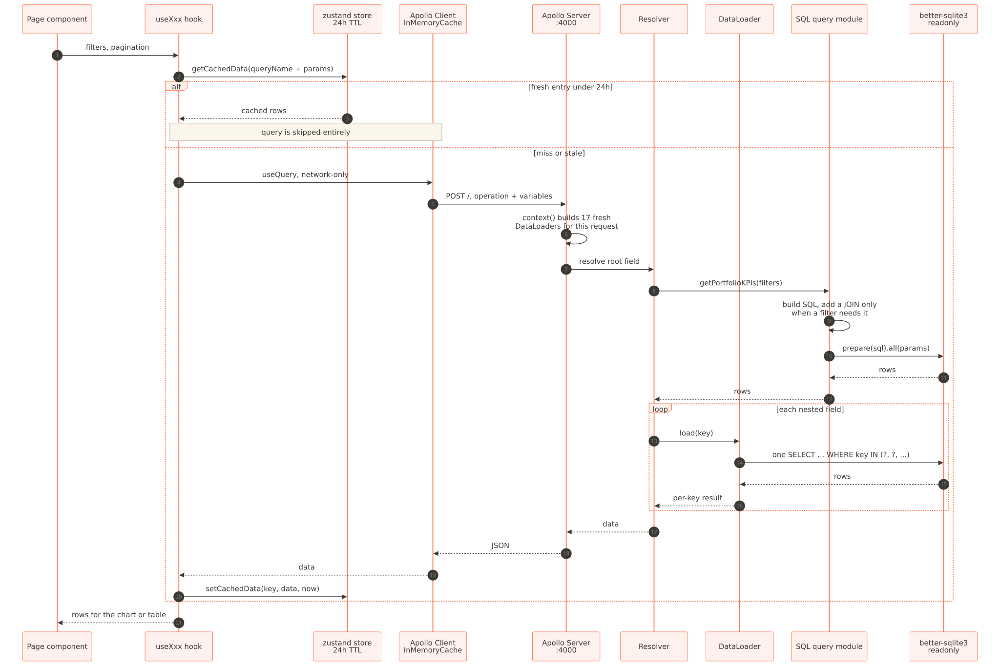

Apollo Server on port 4000. The schema is SDL in `backend/src/schema/typeDefs.ts` and the
resolvers are a hand-written map. Introspection and the landing page are off in production
unless `ENABLE_GRAPHQL_PLAYGROUND=true`.

The server holds nothing between requests. Apollo calls a `context` function once per HTTP
request, before any resolver runs, and this one returns a fresh set of DataLoaders. A
DataLoader remembers every key it has looked up for as long as it lives, so a set shared
across requests would go on returning rows it read before the gold file was replaced. A set
built per request cannot. Rebuilding them costs nothing, because the work they save happens
inside a single request: one query per relationship instead of one per row. Section 6.3
describes that batching.

The 37 root query fields fall into five groups.

**Counters and aggregates.** All take the same five optional filter arrays —
`global_health_areas`, `primary_disease_names`, `secondary_disease_names`, `product_names`,
`phase_names` — unless noted.

| Field | Extra arguments | Returns |
| --- | --- | --- |
| `portfolioKPIs` | — | `PortfolioKPIs!` |
| `clinicalTrialStats` | — | `ClinicalTrialStats!` |
| `regulatoryDistribution` | — | `RegulatoryDistribution!` |
| `globalHealthAreaSummaries` | `candidate_types` | `[GlobalHealthAreaSummary!]!` |
| `ghaProductTypeSummaries` | `candidate_types` | `[GhaProductTypeSummary!]!` |
| `diseaseSummaries` | `candidate_types`, `technology_types` | `[DiseaseSummary!]!` |
| `diseaseProductTypeSummaries` | `candidate_types` | `[DiseaseProductTypeSummary!]!` |
| `productDistribution` | `candidate_type` | `[ProductDistributionRow!]!` |
| `productPhaseDistribution` | `candidate_type` | `[ProductPhaseDistributionRow!]!` |
| `technologyTypeDistribution` | `candidate_type` | `[TechnologyTypeDistributionRow!]!` |
| `phaseDistribution` | `global_health_area`, `product_keys`, `candidate_type` | `[PhaseDistributionRow!]!` |
| `candidateTypeDistribution` | `product_keys`, `phase_names`, areas, diseases | `[CandidateTypeDistributionRow!]!` |
| `geographicDistribution` | `location_scope: String!`, `statuses` | `[GeographicDistributionRow!]!` |
| `temporalSnapshots` | `years`, `product_keys`, `candidate_type` | `[TemporalSnapshotRow!]!` |

**WHO priority alignment.**

| Field | Arguments | Returns |
| --- | --- | --- |
| `priorityAlignmentOverview` | the five filter arrays | `PriorityAlignmentOverview!` |
| `individualPriorityAnalysis` | `priority_key: Int!` + the five filter arrays | `IndividualPriorityAnalysis!` |

**Record-level and paged.** Every connection returns `{ nodes, totalCount, hasNextPage }`.
`limit` is capped server-side at 100 in every one of them.

| Field | Arguments | Returns |
| --- | --- | --- |
| `candidates` | `filter: CandidateFilter`, `limit`, `offset` | `CandidateConnection!` |
| `candidate` | `candidate_key: Int!` | `DimCandidateCore` |
| `portfolioCandidates` | `filter: PortfolioCandidateFilter`, `sort: [ColumnSort!]`, `limit`, `offset` | `PortfolioCandidateConnection!` |
| `clinicalTrials` | `filter: ClinicalTrialFilter`, `sort`, `limit`, `offset` | `ClinicalTrialConnection!` |
| `rdPrioritiesWithCandidates` | `filter: RdPriorityFilter`, `sort`, `limit`, `offset` | `RdPriorityConnection!` |
| `rdPriorities` | `filter: RdPriorityFilter`, `sort`, `limit`, `offset` | `RdPriorityConnection!` |
| `distinctValues` | `table: DataTable!`, `column: String!`, `filter: ColumnFilterContext` | `[String!]!` |

**Slide-overs.** One query fills a whole detail panel.

| Field | Arguments | Returns |
| --- | --- | --- |
| `slideInCandidate` | `candidate_key: Int!` | `SlideInCandidate` |
| `slideInProduct` | `candidate_key: Int!` | `SlideInProduct` |
| `slideInTrial` | `trial_id: Int!` | `SlideInTrial` |

**Reference data.** No arguments: `diseases`, `secondaryDiseases`, `diseaseHierarchy`,
`phases`, `products`, `countries`, `availableYears`, `locationScopes`, `lastSyncDate`,
`pipelineFilterPairs`, `activePipelineFilterPairs`.

The last two are how the filter bar avoids offering combinations that return nothing. They
return the disease-and-product pairs that actually exist, so selecting a disease narrows the
product list.

**How a query reaches the data.** Resolvers hold no logic. `Query.portfolioKPIs` calls
`getPortfolioKPIs()` in `db/queries/kpis.ts`. Each module builds SQL by hand and runs it with
`better-sqlite3`, which is synchronous.

`filterUtils.ts` assembles the SQL in a way that keeps queries small. `addArrayCondition()`
appends a `column IN (?, ?, ...)` clause and records the join that clause needs; joins are
added once each and only when a filter refers to them. A query filtered only by product type
never joins `dim_disease`. The SQL grows with the filters the user has set.

`columnRegistry.ts` maps a front-end column name to a SQL expression, a filter kind (`TEXT`,
`CATEGORY`, `NUMBER`, `DATE`), whether the column can be sorted, and whether it is
*aggregated*. An aggregated column is one whose expression already yields a single
concatenated string per row — a developer list such as `"GSK; Merck"`. A text filter with
`LIKE '%GSK%'` gives the right "contains" result on such a column; a category filter with
`IN (...)` would not, so the registry never offers one. `columnFilters.ts` and
`distinctValues.ts` build `WHERE` and `ORDER BY` from the registry.

### 5.9 Examples of what each page asks for


Query definitions live in `frontend/src/graphql/queries/`. Each is wrapped by one hook in
`frontend/src/graphql/hooks/`. A page never calls Apollo directly; it calls a hook.
Methodology issues no queries; it is static content.

CSV export does not use a separate endpoint. `frontend/src/lib/fetchAllCandidates.js`,
`fetchAllTrials.js` and `fetchAllPriorities.js` page through the same connection queries
client-side until `hasNextPage` is false, then `csv.js` renders the rows using the same column
configuration the on-screen table uses. That is why the export always matches what is on the
screen.

---

## 6. Code explanations

This section explains the choices that shape the code: how each repository is organised, why
it is organised that way, and the business logic that is not obvious from reading it.

### 6.1 igh-data-transform

Python 3.10 or newer, managed with `uv`. Two runtime dependencies: `pandas` for the
transformations and `pycountry` for country resolution. Persistence is the standard library
`sqlite3` module. No ORM.

The approach is declarative. `silver_to_gold/config/schema_map.py` is a dictionary describing
every gold table: where it comes from, what its primary key is, and an expression per column.
`core/` holds a small generic engine that reads that dictionary — extract, evaluate, generate
DDL, load, verify, index.

What that buys:

- **Adding a column is a configuration change.** One line in `schema_map.py`. No new function,
  no new SQL, no new DDL.
- **The data model is readable in one file.** Anyone wanting to know what `dim_priority` holds
  and where it came from reads one block.
- **The engine is tested once.** `COALESCE`, `CASE WHEN`, `LOOKUP:` and `OPTIONSET:` have unit
  tests. Every table gets that behaviour for free.
- **The DDL cannot drift from the map**, because it is generated from it.

The cost is that anything the expression language cannot say has to go somewhere else. Bridge
tables that UNION two sources, dimensions parsed out of delimited strings, and the reporting
year expansion all have dedicated code in `core/bridges.py`, `core/dimensions.py` and
`core/year_expansion.py`. The common case stays declarative and the handful of awkward cases
are explicit.

The gold layer is rebuilt from nothing on every run. `Loader.connect()` unlinks the target file
before it opens it. So a run is idempotent, a failed run leaves nothing half-written, and there
is no migration path to maintain. Rolling back a bad transform means running the previous code
again, not repairing rows.

### 6.2 Error handling, recovery and retry

The three services need different things, and they have different amounts of machinery.

**`igh-data-sync` talks to a network and carries the real logic.**

| Concern | How it is handled | Where |
| --- | --- | --- |
| Rate limiting | HTTP 429 honours the `Retry-After` header when present, otherwise falls back to the backoff schedule | `dataverse_client.py`, `fetch_with_retry()` |
| Backoff | 1, 2, 4, 8, 16 seconds, up to five attempts, then `RuntimeError` | same |
| Server errors | HTTP 5xx retried on the same schedule | same |
| Network errors | `aiohttp.ClientError` and `asyncio.TimeoutError` retried | same |
| Truncated responses | A JSON decode failure is treated as a truncated body and retried, logging the response length | `_parse_json_with_retry()` |
| Expired token | HTTP 401 raises immediately. The token is refreshed at the start of a run, 50 minutes before expiry | `auth.py`, `get_token()` |
| Overload | A semaphore caps concurrent requests at 50 | `dataverse_client.py` |
| Large responses | Long socket and total timeouts, tuned for the largest entity payload | same |
| Unsortable entities | If `$orderby` fails with a 400, the query is retried without it, capped at 5000 records, with a warning | `fetch_all_pages()` |

**Failure is recorded per entity.** `sync_entity()` and
`FilteredSyncManager.sync_filtered_entity()` wrap each entity in `try/except`, record the
failure through `state_manager.fail_sync()` and re-raise. The orchestrator collects the
failures and keeps going, so one bad entity does not lose the other twenty-five. The record is
in two tables: `_sync_state`, one row per entity with its state and last timestamp, and
`_sync_log`, one row per attempt with counts and any error message. These are for diagnosis,
not recovery. Nothing reads them to continue a failed run — the next sync deletes the database
and starts again. They exist so that a failure can afterwards be traced to an entity, a time
and a message. (`get_last_sync_timestamp()` does read `_sync_state`, but only in the
incremental mode described in section 5.1, which is not part of the current procedure.)

**Recovery is a fresh run.** Every sync deletes the bronze database and rebuilds it. A failed
run is retried from the start, and that is safe because there is nothing to resume: the next
run produces a complete bronze database or none.

**Two guards run before anything is written.** `validate_schema_before_sync()` compares the
live Dataverse `$metadata` against the database schema. A type mismatch or a changed primary
key is an error and the sync exits. A new or removed column is informational and the sync
continues — a new column lands in the `json_response` blob rather than as a new SQL column. An
entity in the config but missing from `$metadata` is a warning and is skipped. Separately,
`sync-dataverse --verify` runs `ReferenceVerifier` after the sync and exits non-zero if any
foreign key dangles.

There is no central error-handler module. Handling is inline, per function.

**`igh-data-transform` has almost none of this, and should not.** It reads and writes local
files. There is no network, no rate limit and nothing to back off from. Both stages wrap the
whole run in one `try/except`, log, and return `False`:

```python
def bronze_to_silver(bronze_db_path, silver_db_path) -> bool: ...
def silver_to_gold(silver_db_path, gold_db_path) -> bool: ...
```

`cli.py` turns `False` into exit code 1.

Two failures inside silver-to-gold are non-fatal by design. The first concerns the option set
cache. Before evaluating any expression, `Extractor.build_optionset_cache()` loads every
`_optionset_*` table into a dictionary keyed by column name, mapping each integer code to its
label, so that `OPTIONSET:` expressions resolve in memory rather than by a join per row. If
one of those tables is missing or unreadable it is skipped with a warning, and every
`OPTIONSET:` lookup on that column returns `NULL`. The run continues with a column of empty
labels rather than stopping. Nineteen gold columns resolve this way and not all of them are
minor — `global_health_area` is one of the portal's four filter dimensions — so this is not a
judgement that the data does not matter. It is that one missing lookup costs one column, and
throwing away an otherwise correct rebuild costs the whole release. The gap shows up twice: a
warning naming the table in the run log, and blank labels in that column on the dashboard and user facing missing data will be obvious in staging.

The second is the foreign key check. After loading, `Loader.verify_foreign_keys()` runs 22
orphan checks — for each foreign key, a count of rows whose key value does not exist in the
target table. The situations that produce orphans are all upstream data changes that arrive
between one sync and the next:

- A disease, product or candidate deactivated in Dataverse while another record still points
  at it. The transform drops inactive rows from the dimension, so the fact row's key has no
  target.
- A junction row referencing an account, developer or country that the filtered sync did not
  pull, because nothing else in the synced set referred to it.
- A candidate whose R&D stage GUID no longer resolves, because the stage lookup row was
  renamed or removed.
- A clinical trial whose parent candidate was removed as a duplicate during the silver
  transform.
- An option set code consolidated away in cleaning while a bridge row still carries the old
  code.

The check reports and does not block. The result goes to the log; `run_etl()` returns `True`
regardless. A database with a few orphans is still usable, and the log says where to look.
Every dashboard query joins through the dimension, so an orphaned fact row simply does not
appear.

**Airflow adds the outer loop.** Two retries on ingestion, one on transform and deployment,
each after a five-minute wait, with per-task timeouts. Because every stage rebuilds its output
from scratch, a retry is safe in every case.

### 6.3 The backend

TypeScript on Node, ESM, built with `tsc`. Apollo Server over `better-sqlite3`, and no web
framework in between.

Three choices shape the backend.

**Raw SQL, no ORM or query builder.** Every query in this API is an analytical aggregate over a
star schema — grouped counts, rollups across bridges, join-heavy. An ORM adds a layer to fight
rather than a layer that helps. The SQL reads like the question the chart is asking.

Safety comes from parameter binding. Every user-supplied value is passed as a `?` placeholder,
never concatenated into the statement. SQLite compiles the statement first, with the
placeholders as slots, and only then receives the values, which it treats as data regardless
of what they contain. A filter value of `'; DROP TABLE dim_disease; --` is compared against
column contents as a string and matches nothing. The one place SQL text is assembled
dynamically — the column expressions from `columnRegistry.ts` — draws only from that
registry, never from the request.

**`better-sqlite3`, synchronously.** The database is a local file opened read-only. There is no
network round trip and no connection pool, so a query is a function call measured in
microseconds. Making it asynchronous would add scheduling overhead.

**Schema-first SDL.** One file, `typeDefs.ts`, is the contract. A front-end developer can read
it without reading any TypeScript.

**The table engine.** `columnRegistry.ts` describes each column of each dataset once: its SQL
expression, its filter kind, whether it sorts, and whether it is aggregated. The front end
sends `{ table, column, kind, operator, value }` and gets back filtered, sorted, paged rows
plus the distinct values for a column's filter dropdown. Four datasets, per-column filters,
multi-level sort and CSV export all use that one path.

**DataLoaders.** Nested fields — a candidate's developers, geographies, priorities, trials, and
every sub-field of the slide-over types — go through DataLoaders. Each one collects the keys
requested during one resolver pass, issues a single `WHERE key IN (?, ?, ...)`, and hands each
caller its rows. Without them, a page of 100 candidates would issue hundreds of queries. Section 5.8
explains why a new set is built for every request.

### 6.4 The frontend

Next.js 16 App Router and React 19, styled with Tailwind 4. Recharts for charts, `d3-geo` and
`topojson-client` for the choropleth, `d3-hierarchy` for the bubble layout. TanStack Table for
data tables. Apollo Client for GraphQL. `zustand` for a cache. Built as `output: 'standalone'`.

Every page and layout is a client component. There is no server-side rendering, no
`getServerSideProps`, no `revalidate`. Next.js is used for routing, code splitting, the build
and the standalone server.

That is a reasonable choice here. Pages are interactive from the first paint — every chart has
filters, legends and tabs — so a server-rendered first paint would be discarded almost
immediately. Content is public and identical for everyone, so there is nothing per-user to
render. And the data changes a few times a year, so the browser does more good than a server
render would.

Three pieces do most of the work.

**URL state.** `src/lib/useUrlState.js` with `url-serializers.js` keeps filters, active tab,
pagination and the open slide-over in the query string. Everything the HLD describes as
shareable — "Share this view", bookmarkable filters, deep links from Home into Pipeline
Overview, `&slide=candidate&slideKey=11212` — falls out of that one decision. The share
button copies the current URL.

**Column configuration.** `src/lib/exploreColumnConfig.js` and
`src/lib/extractColumnConfig.js` describe every table column once: label, accessor, filter
kind, renderer, whether it can be hidden, and a separate CSV accessor when the exported value
differs from the displayed one. The table component and the CSV writer read the same object,
so they cannot disagree.

**Content.** User-facing copy lives in `src/content/content.yaml`, not in JSX. A build step
validates it against a schema and generates `content.generated.js`; components read it
through `t('key')` or `<Markdown path="key">`. A missing key throws rather than rendering
"undefined". Section 6.9 describes how that file is edited by people who are not developers.

### 6.5 Caching and optimisation

**Client.** Two layers, both in memory. Apollo Client's `InMemoryCache` holds every response
it has seen, with `cache-and-network` as the default fetch policy. Above it,
`src/store/dashboardStore.js` holds results keyed by query name plus a stable serialisation of
the parameters, with a 24-hour time-to-live. A hook checks the store first. On a fresh hit it
skips the query entirely; on a miss it fetches and writes the result back.

Neither store is persisted. Both live in the page's JavaScript heap and are discarded when the
page is reloaded or closed. The 24-hour limit therefore governs one thing: whether moving
between pages within a single session refetches an aggregate the session has already seen. It
does not delay a data release. An ordinary reload after the pipeline has run fetches everything
afresh, and no cache-clearing is needed.

**Server.** Per-request DataLoaders; 22 indexes on the gold database, each written for a
specific dashboard query; joins added to the SQL only when a filter needs them; `limit` capped
at 100 in every paged query; one connection reused until the file changes.

**What is absent.** No Redis. No server-side response cache. No CDN in front of the app. No
`next/dynamic`, so charts and tables are not lazily loaded beyond the automatic per-route
split. None of these has been needed: the database is a local file, the queries are indexed,
and the traffic is modest. They are the obvious next steps if that changes.

### 6.6 Adding a new reporting year

IGH reviews the pipeline in annual cycles. Each cycle produces a reporting year, and the
portal's trend charts are built on those years.

**How the source records a year.** Dataverse keeps two kinds of column for pipeline
inclusion. A set of year-suffixed columns hold frozen values from closed cycles —
`new_includeinpipeline2021`, `new_2024includeinpipeline`, `new_includeinpipeline2025` and so
on. One unsuffixed column, `new_includeinpipeline`, holds the current cycle and rolls forward:
when a cycle closes, its value is copied into a new suffixed column and the unsuffixed column
starts carrying the next year. R&D stage follows the same pattern with its own columns.

**How the transform reads them.** `transformations/candidates.py` turns one Dataverse row into
one row per reporting year. Two lists inside `_expand_temporal_rows()` drive it, each a list
of `(source_column, boundary_date)` pairs:

```python
_rdstage_cols = [
    ("vin_2019stagepcr",          "2019-01-01"),
    ("new_rdstage2021",           "2021-01-01"),
    ("new_2023currentrdstage",    "2023-01-01"),
    ("new_2024currentrdstage",    "2024-01-01"),
    ("_resolved_rdstage_current", "2025-01-01"),
]

_pipeline_cols = [
    ("vin_2019pcrpipelineinclusion",  "2019-01-01"),
    ("new_includeinpipeline2021",     "2021-01-01"),
    ("new_2023includeinevgendatabase", "2023-01-01"),
    ("new_2024includeinpipeline",     "2024-01-01"),
    ("new_includeinpipeline2025",     "2025-01-01"),
    ("new_includeinpipeline",         "2026-01-01"),
]
```

For each candidate, the code collects the years at which either list has a non-null value.
That set of years is the row grid: the candidate gets one output row per year, with
`valid_from` set to that year's boundary and `valid_to` set to the next. Within each list the
value is **forward-filled**: at each boundary the row carries the most recent non-null value
seen so far, so a candidate with a stage recorded in 2021 and nothing recorded in 2023 keeps
its 2021 stage in the 2023 row. A null in a later column never clears an earlier value. The two
lists are filled independently — a year present in one but not the other still produces a
row, with the other list's value carried forward.

The source columns themselves do not survive the expansion. `_TEMPORAL_SOURCE_COLS` names
every year-suffixed and rolling column; the expansion builds each output row from every
*other* column on the source row and adds four of its own — `new_currentrdstage`,
`includeinpipeline`, `valid_from`, `valid_to`. Downstream code sees one clean set of columns
whatever the year.

Silver-to-gold then runs `core/year_expansion.py` over the result. A version that spans two or
more reporting years — `valid_from` in 2023, `valid_to` in 2025 — has no 2024 row, so it would
vanish from a chart grouped by year. The expansion copies such a row into each intervening
year and moves `is_active_flag` to the last copy.

**Bringing in a new year.** When IGH closes a cycle, Dataverse freezes the current inclusion
value into a new suffixed column and the unsuffixed column begins the next year. To reflect
that in the pipeline, in `transformations/candidates.py`:

1. Add the newly frozen column name to `_TEMPORAL_SOURCE_COLS`.
2. In `_pipeline_cols`, give the frozen column the year it now represents, and move the
   unsuffixed `new_includeinpipeline` entry to the new year's boundary.
3. Point the strict-year capture in `transform_candidates()` at the newly frozen column.
4. Add a unit test for the new boundary in `tests/unit/test_candidates.py`, and an e2e
   assertion in `tests/e2e/test_silver_to_gold_e2e.py` that the new year appears in
   `fact_pipeline_snapshot` and that the two most recent years read distinct columns.
5. Follow the release procedure in section 5.3 so that Airflow runs the new version.

**R&D stage.** The stage list ends with `_resolved_rdstage_current`, the resolved value of the
rolling stage column, pinned to the most recent year that has a frozen stage archive. If IGH
freezes a stage column for a closed year, treat it exactly as above: add the frozen column to
`_TEMPORAL_SOURCE_COLS` and to `_rdstage_cols` with its year, and move the rolling entry to the
new year. Until a stage column is frozen, no change is needed — the forward fill carries the
last known stage into the new year on its own. A candidate that has a stage but no inclusion
flag for a given year produces a stage-only row for that year, which is harmless because every
dashboard query filters on `include_in_pipeline = 1`.

### 6.7 How this could work with SCD2

The sync currently refreshes the whole bronze database on every run, and the pipeline
handles change over time through the year-column approach above. The sync was built, however,
with a possible future move to slowly changing dimensions of type 2 — SCD2 — in mind.

The machinery is present. Every entity table in bronze has a surrogate `row_id`, the Dataverse
business key without a primary key constraint, and `valid_from` / `valid_to` columns. When the
sync is run in update mode against an existing database, an unchanged record only has its
sync time touched; a changed record closes the current row by setting `valid_to` and inserts a
new one with `valid_to` open. Multi-select junction tables are versioned the same way. Option
set lookups are excluded, being reference data.

Run that way continuously, the history accumulates in bronze without any year-specific
column. "Was this candidate in the pipeline at the 2027 review?" becomes "read the row that was
valid on the 2027 review date". The transform's job changes accordingly:

- `_expand_temporal_rows()` reads `valid_from` / `valid_to` instead of the two column lists,
  and the lists go away.
- Review years come from a small table of review dates rather than from column names.
- The gold schema does not change — `fact_pipeline_snapshot` is already one row per candidate
  per year — and nothing above it changes either.

The constraint is that SCD2 only knows what it has seen. Today's bronze is rebuilt on every
run, so it holds no history; the history before continuous syncing begins exists only in the
year-suffixed columns.

This change would largely or entirely remove the manual configuration step each year. The
question of what changed and when would move upstream, to how records are updated in
Dataverse, and the pipeline would carry cleaner data with fewer special cases.

The practical path is to keep the year columns for the historical years that predate
continuous syncing, and derive new years from SCD2 once the bronze database has been running
long enough to cover one. Until then, section 6.6 is the procedure.

### 6.8 Development approach

**Git and GitHub.** Five repositories under `akvo`: the four already described in detail, and
the content repository described in section 6.9, which handles copy editing. Work is done on
branches and merged through pull requests. Production deploys are triggered by publishing a
GitHub Release, so what is live is always a tagged commit.

**GitHub Actions.**

| Workflow | Repository | Trigger | What it does |
| --- | --- | --- | --- |
| `qa.yml` | `igh-dashboard`, `igh-data-transform`, `igh-airflow` | push to `main`, PR opened/reopened/synchronised | Lint, type check, test. Cancels superseded runs. |
| `test.yml` | `igh-data-sync` | the same triggers | The same job under a different name. |
| `deploy-vm.yml` | `igh-dashboard` | push to `main` | SSH to the test VM and update it. |
| `deploy-prod.yml` | `igh-dashboard`, `igh-airflow` | release published | SSH to the production VM and update it. |
| `content-sync.yml` | `igh-dashboard` | `content.yaml` changes, `repository_dispatch`, manual | Two-way sync with `akvo/igh-dashboard-content`. |

Both deploy workflows use `akvo/composite-actions`' `ssh-command` action with the server
address, port, user and key from the GitHub Environment, running the command held in the
`COMMAND` Actions variable. The runners are GitHub-hosted. There are no self-hosted runners;
`self-hosted/` is what the servers run, not where the CI runs.

**Testing.**

| Repository | Approach |
| --- | --- |
| `igh-dashboard` backend | Unit tests mock the database connection and the loaders. E2E tests run real GraphQL operations in-process against the committed `tests/star_schema.db` — no HTTP. |
| `igh-dashboard` frontend | Component and hook tests under `__tests__/`, mirroring `src/`. Storybook stories for the component library. |
| `igh-data-sync` | Unit tests mirroring `src/`, plus e2e against a fake Dataverse client. |
| `igh-data-transform` | Unit tests, plus e2e tests behind `--e2e` / `--all` that build a real bronze → silver → gold chain and assert row counts per layer, that every expected reporting year appears in `fact_pipeline_snapshot`, and that the two most recent years read distinct source columns. They skip unless `E2E_BRONZE_DB_PATH` points at a real bronze database, so CI runs unit tests only. |
| `igh-airflow` | DAG structure only: task counts, ordering, outlets, and that `DEPLOY_AUTO_TRIGGER` changes the schedule. No task bodies are executed. |

The backend e2e tests are the largest protection against regressions. They compare rendered
CSV against golden files in `tests/fixtures/csv/`. That catches a change in the transform, the
SQL, the column configuration or the CSV writer, in one assertion. Fixtures are regenerated
with `UPDATE_FIXTURES=1` — after running the suite once without it and inspecting each failure
to confirm the change is expected.

`igh-data-transform/scripts/qa.sh` is the single entry point for lint, format and test, used
identically by a developer and by CI, so the two cannot drift. `npm run check:all` plays the
same role in `igh-dashboard`.

**Static analysis.**

| Repository | Tools |
| --- | --- |
| `igh-data-sync` | ruff with a wide rule set including complexity and argument limits, mypy in gradual mode, a pylint rule capping module length, and pre-commit hooks including a fast `pytest --maxfail=1`. |
| `igh-data-transform` | ruff, default rule set. |
| `igh-airflow` | ruff. |
| `igh-dashboard` backend | `tsc --noEmit`, ESLint with complexity and nesting-depth limits as errors, Prettier. |
| `igh-dashboard` frontend | ESLint and Prettier are not configured. This is a gap. Architecture approach and style were manually reviewed. |

**Use of AI.** The code in these repositories was partially written with AI assistance but
always fully reviewed and tested by humans. Work is planned by a human before implementation —
both the overall approach and feature by feature. Every change is manually reviewed and tested
— by the developer who made it, and then by a peer in code review. All code must pass CI, it
has to be understood by the person who submits it, and it has to be understood by the person
who approves it. Everything is manually QAed before release.

### 6.9 The content repository

`akvo/igh-dashboard-content` exists so that IGH staff can change the site's copy without a
developer and without touching the dashboard code. The client has their own documentation for
editing; this section describes only the shape.

The dashboard holds the copy in one file, `frontend/src/content/content.yaml`, keyed by dotted
names such as `home.hero.title`. The content repository projects that file into one small text
or markdown file per key, grouped into a folder per page. An editor opens a file in the
GitHub web interface, changes it and commits. Nothing else in that repository is for editing;
the schema and the scripts are maintained by the sync.

A push to the content repository validates the change — length limits, safe markdown — and
dispatches an event to the dashboard repository. There, `content-sync.yml` performs a
three-way merge between the content repository, `content.yaml` and a snapshot of the last
agreed state. Where only one side changed a key, that side wins and both are updated. Where
both changed the same key differently, the merge records a conflict, rolls that key back to the
last agreed value so nothing half-resolved deploys, and opens a GitHub issue for a developer to
resolve with `npm run content:resolve`. A successful merge commits to both repositories, and
the staging deploy follows on the push.

Adding or removing a key is a developer change, because the set of keys is part of the code:
`content.schema.json` lists them, and a build-time check confirms that every key in the schema
has a value and is used somewhere in `src/`.

---

## 7. Infrastructure


The system runs on two Linux hosts, each running Docker and Docker Compose behind Traefik,
each with a public DNS record and ports 80 and 443 open. One carries Airflow and the pipeline;
the other carries the dashboard. Everything below is defined by files in the repositories —
the Compose stacks under `self-hosted/`, and the workflows under `.github/workflows/`.

### 7.1 Environments

| Environment | Database source |
| --- | --- |
| Production — `pipeline.impactglobalhealth.org` | Delivered by `igh_deployment`. `IS_PRODUCTION=true` stops a code deploy overwriting it. |
| Test | `backend/star_schema.db` from the repository, re-copied on every deploy |
| Airflow | The bronze, silver and gold SQLite files on a volume |

Google Analytics is enabled only on the production hostname, so the test site does not report
traffic.

### 7.2 Routing and TLS

Both stacks put Traefik in front and get certificates from Let's Encrypt automatically.

The dashboard stack uses a file provider. `generate_dynamic_config.sh` writes
`/traefik-config/dynamic.yml` at container start from `WEBDOMAIN`:

- `Host(<domain>)` → `frontend-service` at `http://localhost:3000`
- `Host(<domain>) && PathPrefix(/api)` → `api-service` at `http://localhost:4000`, with a
  `stripPrefix` middleware removing `/api`

Certificates come from the `myresolver` ACME resolver using the TLS challenge, stored in a
named volume. The Airflow stack does the same with Traefik labels and its own resolver, plus
an HTTP-to-HTTPS redirect.

Because the frontend calls the API at `/api` on the same origin, there is no CORS
configuration and no second certificate.

### 7.3 Deployment

**Code.** Both deploy workflows do the same thing: SSH in and run a command held in the
`COMMAND` Actions variable. On the server that command is `update.sh`:

```bash
git pull
# staging only: cp ../backend/star_schema.db ./data/star_schema.db
docker compose build --no-cache
docker compose stop && docker compose up -d
```

Test deploys on every push to `main`. Production deploys when a GitHub Release is published.
Both use a concurrency group with `cancel-in-progress: false`, so deploys queue rather than
interrupt each other.

`install.sh` and `update.sh` are byte-identical. `restart.sh` restarts without rebuilding.

There is a short outage during a code deploy: `docker compose stop` runs before
`up -d`, and the image is rebuilt with `--no-cache` first, so the site is down for the length
of a container restart.

**Data.** Data deploys are separate and have no outage. `igh_deployment` copies the file to
`star_schema.db.new`, then renames it over the live file in one atomic operation. The backend
notices the inode change on its next connection and reopens. Requests in flight keep reading
the old file through their open descriptor.

**Front-end environment variables.** `NEXT_PUBLIC_*` values are normally inlined at build time
by Next.js. `docker-entrypoint.sh` works around that: at container start it writes every
`NEXT_PUBLIC_` variable into `public/__ENV.js` as `window.__ENV`, so the same image can be
deployed to test and production without rebuilding.

## Appendix A: Regenerating the diagrams

Every diagram in this document is generated from a mermaid source file in `diagrams/`. The
`.mmd` files are the source of truth. Nothing in `diagrams/out/` is edited by hand.

To change a diagram, edit its `.mmd` file and re-render it:

```bash
cd docs/lld
./render-diagrams.sh                  # all diagrams
./render-diagrams.sh 10-gold-star-schema  # just one
```

The script writes an SVG and a 3x PNG for each source. The document embeds the SVG; the PNG is
there for `pandoc` and Word export. All diagrams share `diagrams/mermaid-config.json`, so the
palette and typography match the product.

| File | Figure |
| --- | --- |
| `01-system-context.mmd` | System context |
| `02-container.mmd` | Containers |
| `03-component-data-pipeline.mmd` | Data pipeline components |
| `04-component-backend.mmd` | Backend components |
| `05-component-frontend.mmd` | Frontend components |
| `06-component-all.mmd` | All repositories |
| `07-dag-dataflow.mmd` | DAG data flow |
| `08-data-update-process.mmd` | Data update process |
| `09-bronze-to-silver.mmd` | Bronze to silver cleaning |
| `10a-gold-star-pipeline.mmd` | Pipeline snapshot star |
| `10b-gold-star-trials.mmd` | Trial and publication star |
| `11-gold-bridge-tables.mmd` | Gold bridge tables |
| `12-graphql-request.mmd` | GraphQL request path |
| `13-page-query-map.mmd` | Page to query map |
| `14-infrastructure.mmd` | Infrastructure |

See `docs/lld/README.md` for details.
